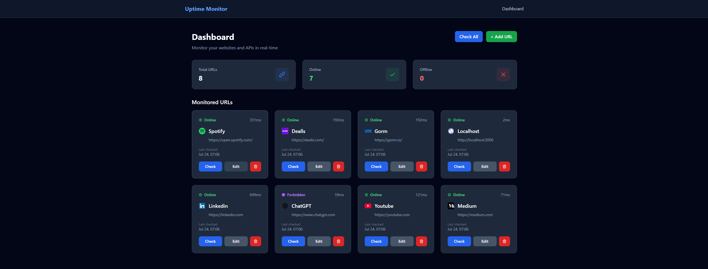

# Note
This code is vibe coding project to help me create something to practice deployment.

# Uptime Monitoring Website

A modern uptime monitoring application built with Go Fiber, Tailwind CSS, and Templ template engine featuring a glow-dark theme.

## Features

- ✅ CRUD operations for URLs
- 🔍 Real-time uptime checking
- 📊 Response time monitoring
- 🎨 Beautiful glow-dark theme
- 📱 Responsive design
- 🚀 Fast and lightweight

## Tech Stack

- **Backend**: Go with Fiber framework
- **Frontend**: Tailwind CSS with glow-dark theme
- **Template Engine**: Templ
- **Database**: SQLite with golang-migrate
- **Styling**: Tailwind CSS with custom glow effects

## Setup

1. **Clone and navigate to the project**:
   ```bash
   cd ~/uptime-monitoring
   ```

2. **Install dependencies**:
   ```bash
   go mod tidy
   ```

3. **Install Templ CLI** (if not already installed):
   ```bash
   go install github.com/a-h/templ/cmd/templ@latest
   ```

4. **Generate templates**:
   ```bash
   templ generate
   ```

5. **Run the application**:
   ```bash
   go run main.go
   ```

6. **Open your browser** and navigate to `http://localhost:3000`

## Usage

### Adding URLs
1. Click "Add URL" button on the dashboard
2. Enter a name and URL (e.g., "My Website", "https://example.com")
3. Click "Add URL" to save

### Monitoring URLs
- View all monitored URLs on the dashboard
- See real-time status (🟢 UP, 🔴 DOWN, 🟡 UNKNOWN)
- Check response times in milliseconds
- View last checked timestamps

### Manual Checks
- Click "Check Now" for individual URLs
- Click "Check All URLs" to check all monitored URLs at once

### Managing URLs
- **Edit**: Click "Edit" to modify URL name or address
- **Delete**: Click "Delete" to remove a URL (with confirmation)

## API Endpoints

### URLs
- `GET /api/urls` - Get all URLs
- `GET /api/urls/:id` - Get specific URL
- `POST /api/urls` - Create new URL
- `PUT /api/urls/:id` - Update URL
- `DELETE /api/urls/:id` - Delete URL

### Monitoring
- `POST /api/check/:id` - Check specific URL
- `POST /api/check-all` - Check all URLs

## Development

### Project Structure
```
├── main.go              # Application entry point
├── database/            # Database connection and migrations
├── handlers/            # HTTP handlers
├── models/              # Data models and repository
├── services/            # Business logic (uptime checker)
├── templates/           # Templ templates
├── migrations/          # Database migrations
└── go.mod              # Go dependencies
```

### Making Changes

1. **Template changes**: After modifying `.templ` files, run `templ generate`
2. **Database changes**: Create new migration files in the `migrations/` directory
3. **Styling**: Modify the Tailwind classes in templates for UI changes

## Theme

The application features a custom "glow-dark" theme with:
- Dark background with gray tones
- Cyan/blue glow effects
- Status-specific colors (green for up, red for down, yellow for unknown)
- Smooth transitions and hover effects
- Responsive design for all screen sizes